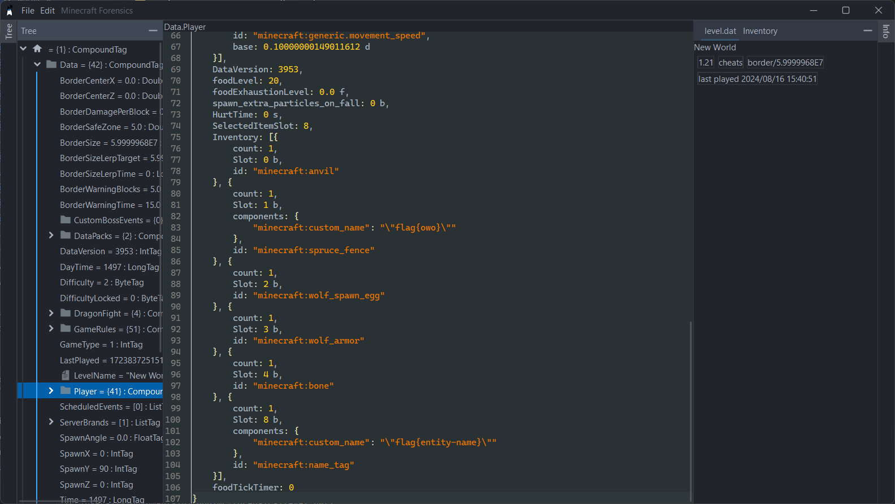

## Minecraft Forensics Tool

## Functionality

1. Read NBT files
2. Built-in JS engine to run scripts on selected node for automation

## Planned

- [ ] Read chunk files
- [ ] Integrated save folder reading
- [ ] Allow editing